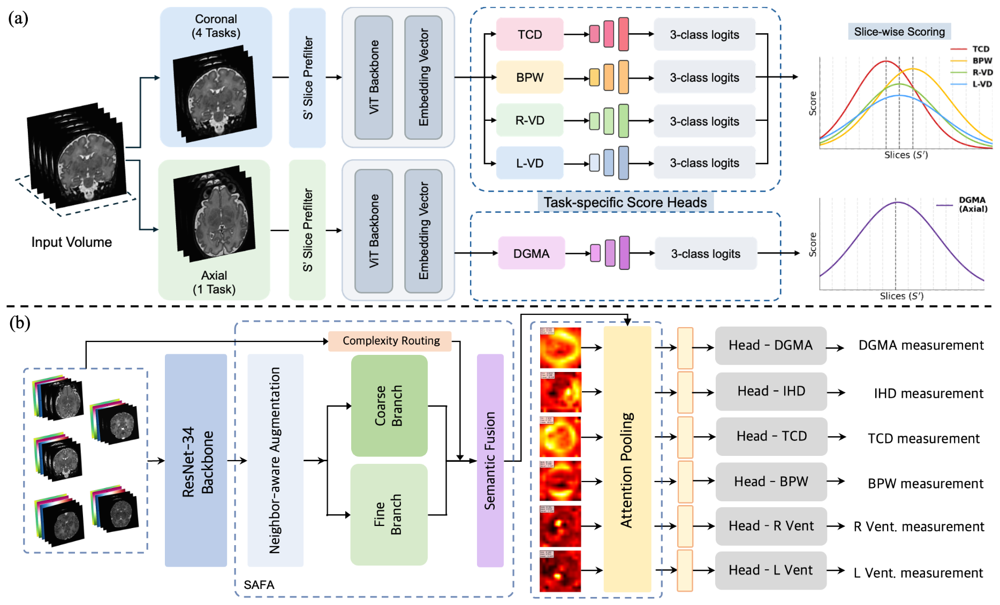

<div align="center">

# MEASURE: Multi-Task Slice Selection and Regression for Neonatal Brain Biometry

**MICCAI 2026**

Jiyang Lee<sup>1*</sup>, Woori Bae<sup>1*</sup>, Dabin Kim<sup>2</sup>, Jong-Min Lee<sup>1†</sup>, Seh Hyun Kim<sup>2,3†</sup>

<sup>1</sup>Hanyang University &nbsp; <sup>2</sup>Seoul National University Children's Hospital &nbsp; <sup>3</sup>Seoul National University College of Medicine<br>
<sup>*</sup>Equal contribution &nbsp; <sup>†</sup>Corresponding authors

[Paper](https://papers.miccai.org/miccai-2026/paper/4530_paper.pdf) | [MICCAI page](https://papers.miccai.org/miccai-2026/0622-Paper4530.html)

</div>

> Code is not released yet. Star or watch this repo for updates.

## Overview

Manual brain biometry on neonatal MRI takes 15–30 minutes per scan and varies between raters. Existing automation needs dense voxel-wise annotations.

MEASURE predicts six Kidokoro-protocol biometrics **without voxel-level supervision**. It needs only the measurement values and the slice each was measured on. It covers the quantitative biometry part of the Kidokoro framework, not the full score.

<p align="center"></p>

**Stage 1 · Slice selector.** A ViT scores 2.5D slices and returns the top-2 measurement planes per task. There is one coronal selector (TCD, BPW/IHD, R-VD, L-VD) and one axial selector (DGMA). It is trained with 3-class soft labels (target / neighbour / other), class-weighted CE, and a set-level loss.

**Stage 2 · Biometry predictor.** A ResNet-34 regresses all six measurements jointly from the selected slices. It has three components:
- **SAFA** adds through-plane context from inter-slice differences and routes each region through a fine or coarse branch by edge complexity.
- **Measurement-specific attention pooling** gives each biometric its own spatial weighting.
- **AAR** regularizes the attention maps: left/right ventricular symmetry, smoothness, and distinctiveness.

**Limitations:** simulated thick-slice data, a single site, and a single rater. Validation on real clinical scans is future work.

## Citation

```bibtex
@InProceedings{LeeJiy_MEASURE_MICCAI2026,
        author = { Lee, Jiyang AND Bae, Woori AND Kim, Dabin AND Lee, Jong-Min AND Kim, Seh Hyun},
        title = { { MEASURE: Multi-Task Slice Selection and Regression for Neonatal Brain Biometry } },
        booktitle = {Medical Image Computing and Computer Assisted Intervention -- MICCAI 2026},
        year = {2026},
        publisher = {Springer Nature Switzerland},
        volume = {LNCS 16894},
        month = {September},
        page = {pending}
}
```

## Acknowledgments

Supported by IITP (MSIT, No. RS-2020-II201373, AI Graduate School Program, Hanyang University), and by NIPA (MSIT) with the Daegu Digital Innovation Promotion Agency (DIP). We thank the dHCP and FeTA Challenge teams for their data.
